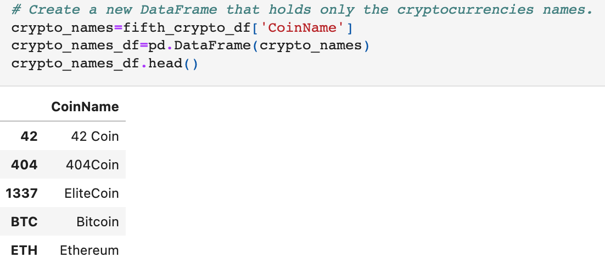
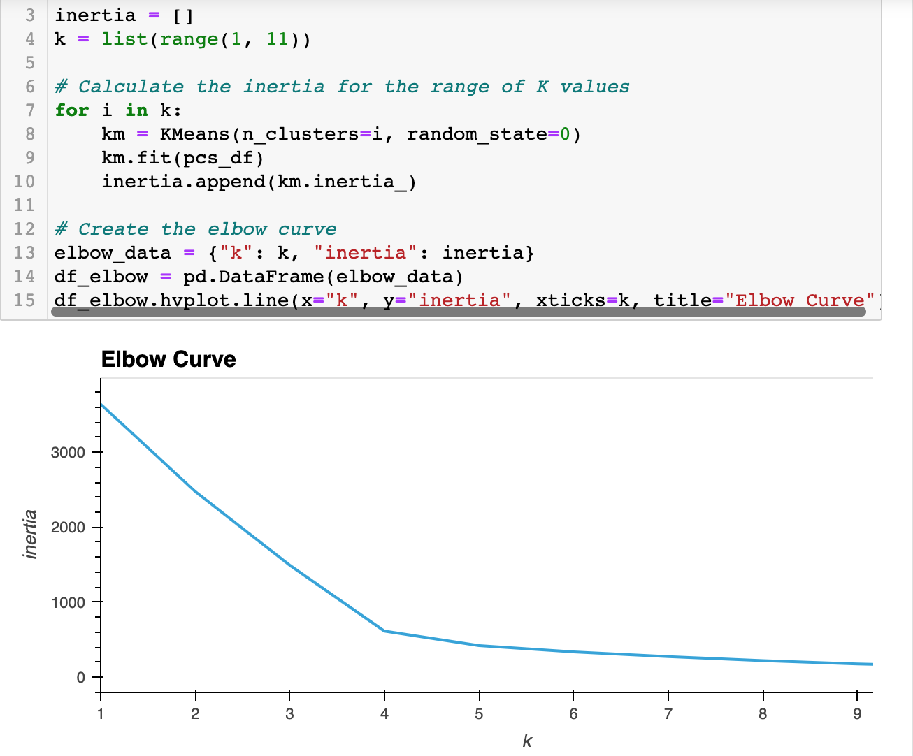
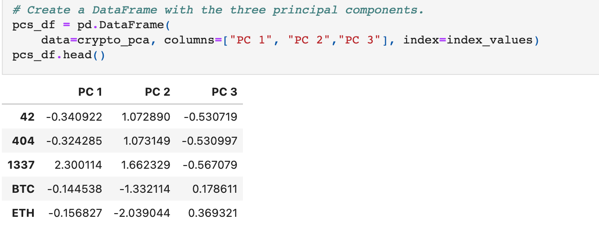
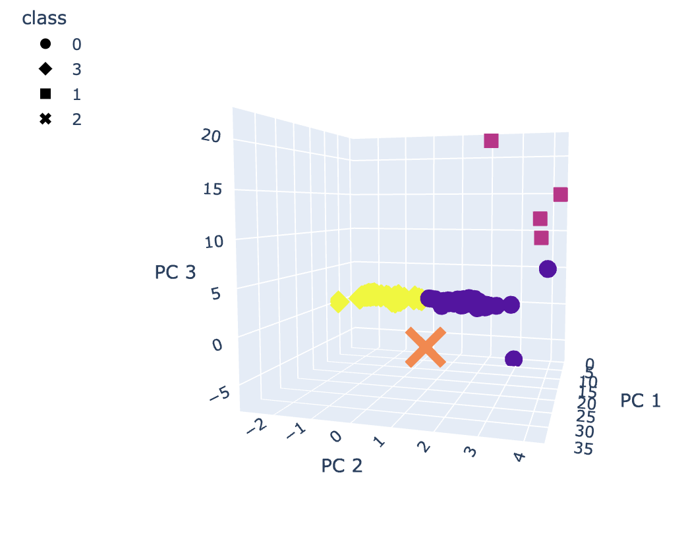

# Cryptocurrencies

# **Purpose**
The purpose of this analysis was to discover trends in affordable cryptocurrencies for a client. The client wishes to offer a new crypto currency in their investment portfolio for customers. The report delivered to the client would use unsupervised machine learning with a clustering algorithm to group the cryptocurrencies and discover trends.

## **Goal**
- Preprocessing the Data for PCA
- Reducing Data Dimensions Using PCA
- Clustering Cryptocurrencies Using K-means
- Visualizing Cryptocurrencies Results

## **Resources**
- Dataset:crypto_data.csv
- Software: Pandas, scikit-learn, Unsupervised Machine Learning, Jupyter Notebook, Python, Kmeans, CPA

## **Results**
The dataset, in the format of CSV, was preprocessed in order to perform later machine learning algorithms. It was filtered for Coin Names that are actively being traded and that actual coins mined were greater than 0. All nan rows were dropped. The names of the Crypto Coins was extracted and saved in a dataframe:

 

The X and Y variables were extracted from the cleaned dataframe into their own and then scaled so the results would be balanced.  Next, the Principal Component Analysis (PCA) algorithm was used to reduce the dimensions of the X DataFrame to three principal components. This information was stored into a new dataframe called pcs_df.

The K-means algorithm was then applied to the pcs_df. The best value for K was revealed by using a for loop to store the inertia values. The values were then plotted in an elbow curve which showed 4 to be the optimal value for K.

 

The K-means algorithm was rerun with the value of n_clusters=4  to predict the K clusters for the cryptocurrencies’ data. The predicted values were stored in a dataframe. 

 

The results of the K-means predictions were plotted into an interactive 3-D scatter plot to reveal the trends and groups in cryptocurrencies. The analysis produced 532 tradable cryptocurrencies. The grouping allows the client to easily add similar cryptocurrency types to a customers portfolio.

 
